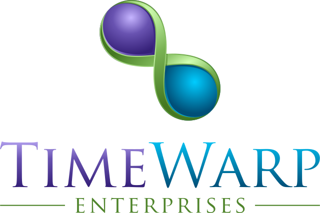

[](https://dotnet.microsoft.com)
[](https://github.com/TimeWarpEngineering/timewarp-quickbooks)
[](https://discord.gg/7F4bS2T)
[](https://github.com/TimeWarpEngineering/timewarp-quickbooks/actions/workflows/ci-build.yml)
[](https://www.nuget.org/packages/TimeWarp.QuickBooks/)
[](https://www.nuget.org/packages/TimeWarp.QuickBooks/)
[](https://github.com/TimeWarpEngineering/timewarp-quickbooks/issues)
[](https://github.com/TimeWarpEngineering/timewarp-quickbooks)
[](https://github.com/TimeWarpEngineering/timewarp-quickbooks/blob/master/LICENSE)
[](https://twitter.com/intent/tweet?url=https://github.com/TimeWarpEngineering/timewarp-quickbooks)

[](https://twitter.com/intent/follow?screen_name=StevenTCramer)
[](https://twitter.com/intent/follow?screen_name=TheFreezeTeam1)

# TimeWarp.QuickBooks



TimeWarp.QuickBooks is a .NET library for QuickBooks Online integration.

## Give a Star! :star:

If you like or are using this project please give it a star. Thank you!

## Features

- Easy authentication with QuickBooks Online API
- Simple interfaces for common QuickBooks operations
- Comprehensive testing with TimeWarp.Fixie
- Designed with modern .NET practices

## Getting started

To quickly get started I recommend reviewing the samples in this repo.

## Installation

```console
dotnet add package TimeWarp.QuickBooks
```

You can see the latest NuGet packages from the official [TimeWarp NuGet page](https://www.nuget.org/profiles/TimeWarp.Enterprises).

* [TimeWarp.QuickBooks](https://www.nuget.org/packages/TimeWarp.QuickBooks/) [](https://www.nuget.org/packages/TimeWarp.QuickBooks/)

## CI/CD Pipeline

This project uses GitHub Actions for continuous integration and deployment:

- **CI Build**: Runs on pull requests to validate code quality
- **Release Build**: Automatically publishes new versions to NuGet when pushed to the master branch

### Required GitHub Secrets

To use the GitHub Actions workflows, you need to configure the following secret in your repository:

- `PUBLISH_TO_NUGET_ORG`: Your NuGet API key for publishing packages

## Documentation

Comprehensive documentation is available in the Documentation directory:

- [User Documentation](Documentation/User/Overview.md) - How to use the library
- [Developer Documentation](Documentation/Developer/Overview.md) - How to contribute or extend the library

## Development Process

This project follows the Kanban methodology for task management. You can find current work in the [Kanban](Kanban/ReadMe.md) directory.

### Running Tests

```console
pwsh RunTests.ps1
```

## Contributing

We welcome contributions! Please see our contribution guidelines for details.

## Unlicense

[](https://unlicense.org)

## Contact

Sometimes the GitHub notifications get lost in the shuffle. If you file an [issue](https://github.com/TimeWarpEngineering/timewarp-quickbooks/issues) and don't get a response in a timely manner feel free to ping on our [Discord server](https://discord.gg/A55JARGKKP).

[](https://discord.gg/7F4bS2T)

## Acknowledgments

- [TimeWarp.Fixie](https://github.com/TimeWarpEngineering/timewarp-fixie) for testing infrastructure