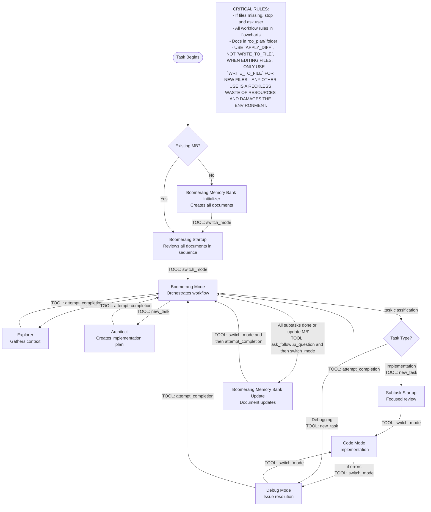
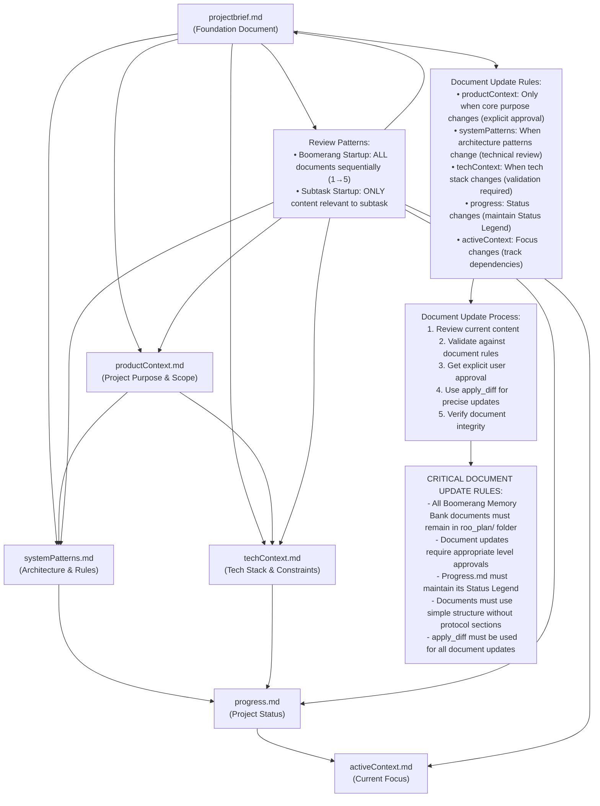
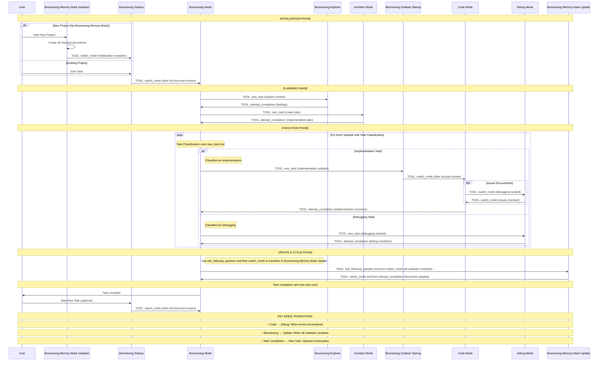

# Boomerang Workflows Section - Boomerang Memory Bank

## Main Workflow

## Document Structure & Review Rules

## Workflow Sequence

The flowcharts above provide the complete workflow rules for the Boomerang Memory Bank system. Any changes to the workflow should be made by updating these flowcharts.