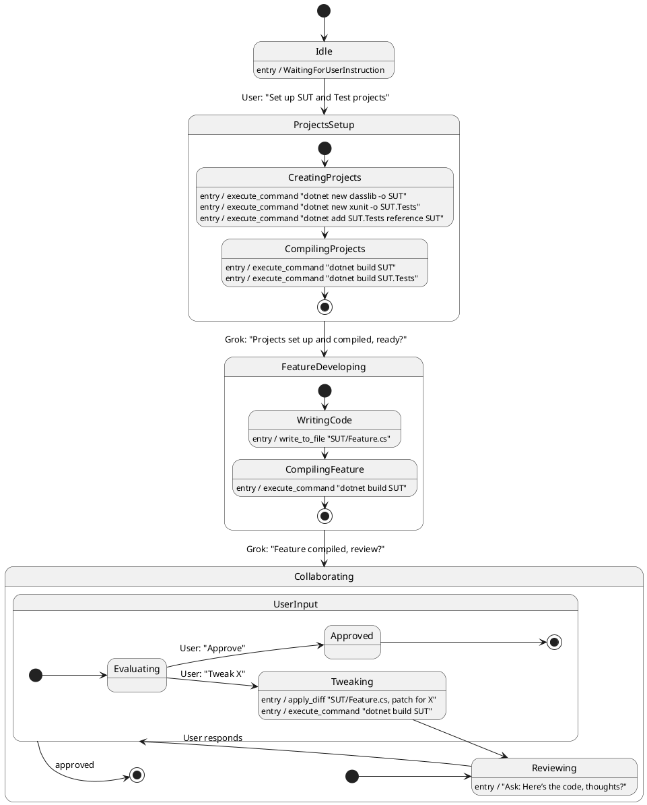

```plantuml
@startuml
left to right direction

state Idle
Idle : entry / WaitingForUserInstruction
[*]->Idle

state ProjectsSetup {
    state CreatingProjects
    CreatingProjects : entry / execute_command "dotnet new classlib -o SUT"
    CreatingProjects : entry / execute_command "dotnet new xunit -o SUT.Tests"
    CreatingProjects : entry / execute_command "dotnet add SUT.Tests reference SUT"
    
    state CompilingProjects
    CompilingProjects : entry / execute_command "dotnet build SUT"
    CompilingProjects : entry / execute_command "dotnet build SUT.Tests"
    
    [*]->CreatingProjects
    CreatingProjects -> CompilingProjects
    CompilingProjects -> [*]
}

state FeatureDeveloping {
    state WritingCode
    WritingCode : entry / write_to_file "SUT/Feature.cs"
    
    state CompilingFeature
    CompilingFeature : entry / execute_command "dotnet build SUT"
    
    [*]->WritingCode
    WritingCode -> CompilingFeature
    CompilingFeature -> [*]
}

state Collaborating {
    state Reviewing
    Reviewing : entry / "Ask: Here’s the code, thoughts?"
    
    state UserInput {
        [*] --> Evaluating
        Evaluating --> Approved : User: "Approve"
        Evaluating --> Tweaking : User: "Tweak X"
        state Approved
        state Tweaking
        Tweaking : entry / apply_diff "SUT/Feature.cs, patch for X"
        Tweaking : entry / execute_command "dotnet build SUT"
        Tweaking --> Reviewing
        Approved --> [*]
    }
    
    [*] --> Reviewing
    Reviewing --> UserInput : User responds
    UserInput --> [*] : approved
}

Idle -> ProjectsSetup : User: "Set up SUT and Test projects"
ProjectsSetup -> FeatureDeveloping : Grok: "Projects set up and compiled, ready?"
FeatureDeveloping -> Collaborating : Grok: "Feature compiled, review?"
@enduml
```

